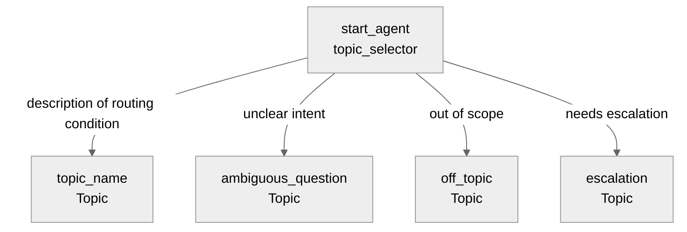

# Agent Spec: Agent_API_Name

## Purpose & Scope

Describe the agent's purpose in 1-2 sentences. What does it help users do?
What domain does it operate in?

## Behavioral Intent

Describe the key behavioral rules that govern the agent:
- What must the agent know before taking action?
- What backing logic types are used (Apex, Flow, Prompt Template)?
- What guardrails apply (off-topic handling, escalation)?
- What information persists across topic switches?

## Topic Map

Expand the diagram to show actions, gating logic, and variable state changes
within each topic. See the Topic Map Diagrams reference for conventions.

## Variables

- `variable_name` (mutable type = default) — What this variable tracks.
  Set by: which action or utility. Read by: which topics for gating or
  conditional instructions.

## Actions & Backing Logic

### action_name (topic_name topic)

- **Target:** `apex://ClassName` or `flow://FlowName` or `prompt://PromptTemplateName`
- **Backing Status:** EXISTS / NEEDS STUB / NEEDS IMPLEMENTATION
- **Inputs:** List each input with type and description
- **Outputs:** List each output with type and description
- **Stubbing requirement:** If NEEDS STUB, describe the stub class/flow needed

Repeat for each action.

## Gating Logic

- `action_name` visibility: `available when @variables.variable_name != ""`
  — Rationale for why this gate exists.

List all gating conditions with their rationale.

## Architecture Pattern

State the architecture pattern: hub-and-spoke, chain, hybrid, etc.
Describe the routing strategy and how topics relate to each other.

## Agent Configuration

- **developer_name:** `Agent_API_Name`
- **agent_label:** `Agent Display Name`
- **default_agent_user:** Verify this user exists in the target org
