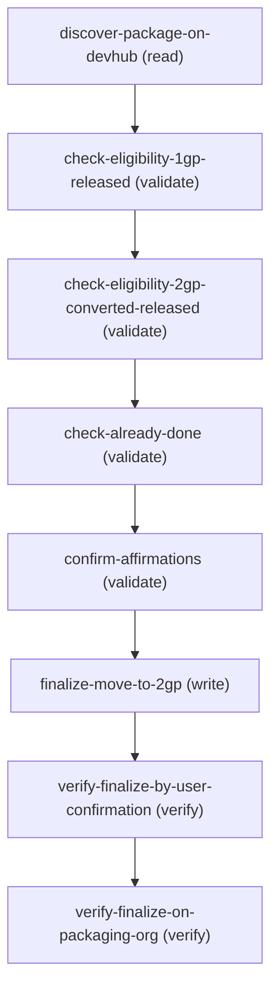

# Move to 2GP Development

## When to Use This Skill

Finalize the irreversible, one-way Move-to-2GP cutover for a converted 1GP managed package — afterward, new major/minor 1GP versions can NEVER be created. Use when an ISV admin asks to move a 1GP package to 2GP development. The agent dispatches the finalize directly via the packaging Connect API (POST /connect/packaging/package/{packageId}/finalize-move-to-2gp, shipped 266) after clearing the eligibility + conversion/subscriber-migration-testing gates and obtaining the three explicit affirmations the endpoint requires; it then wire-verifies the result against PackageConversion.EndDate (read-only Tooling exposure, shipped 264).

## Workflow

---
BACKEND / VERSIONING MECHANICS (relocated from the discover card — describe-only, never shown on the card):
- FINALIZE DISPATCH (266+): the agent-dispatchable path is the packaging Connect API POST /services/data/v69.0/connect/packaging/package/{packageId}/finalize-move-to-2gp (operationId finalizeMoveTo2gp), which runs against the 1GP DE org. The endpoint enforces the CreatePackaging edit-access gate, requires all three affirmation flags true, and verifies the {packageId} in the URL matches the package the org is currently converting — a mismatch returns 400. On success it finalizes the conversion, after which PackageConversion.EndDate is set (observable via verify-finalize-on-packaging-org). It performs the same finalize action that was previously available only through the Setup UI's Move-to-2GP dialog.
- PRE-266 HISTORY / FALLBACK: before 266 no public agent-dispatchable API existed — finalize was available only as a Setup-page action the user completed in the browser, with no stable programmatic contract. The fallback delivers the user to the package's Setup detail page at `/udd/AllPackage/viewAllPackage.apexp` (any authenticated browser session to the packaging org reaches it), which hosts the "Move to Second-Generation Managed Packaging" dialog and its Proceed action. This remains the fallback for orgs on a pre-266 release.
- CANNOT-CREATE BOUNDARY, MECHANICS: after finalize, new major/minor 1GP versions cannot be created — neither via `sf package1 version create` nor via the major/minor upload flow on viewAllPackage.apexp; all new major/minor innovation must use 2GP via `sf package version create`. Customers running on prior 1GP versions are unaffected.
- PATCH EXCEPTION (surface conversationally only when the user asks e.g. "can I still cut a patch?"): PATCH versions of major.minor versions that existed BEFORE finalize remain permitted, to hotfix 1GP subscribers not yet migrated to 2GP. This exception is intentionally NOT part of the affirmation prompt the user confirms (the Setup dialog uses the same headline framing) — never put it in the affirmation.
- ELIGIBILITY GATE (3-part proactive pre-check, two-org query): (a) the 1GP package's highest Released major.minor version, queried from the 1GP DE org via MetadataPackageVersion; (b) a corresponding 2GP-converted Package2Version at the same major.minor on DevHub, AND that 2GP version is Released; (c) no native 2GP version exists yet on DevHub (its presence means Move-to-2GP already happened — early exit). Parts (b)/(c) are the DevHub-side pre-check: run them when DevHub is authenticated to give the user a clear up-front answer; if (a) or (b) fails, surface what's missing + the fix (typically promote the converted 2GP version to Released). When DevHub is unavailable, this proactive check is skipped and the finalize endpoint enforces the same eligibility server-side (→ 400 on mismatch). DevHub eligibility queries hit the Package2 / Package2Version 0Ho-prefix entity.
- PRE-FLIGHT (mandatory): Salesforce docs state "Before you complete your move to 2GP package development, it's critical that you thoroughly test package conversions and subscriber migrations first." Never invoke the manual step without explicit user affirmation that conversion + subscriber-migration testing is complete.
- RELEASE HISTORY (both milestones shipped): 264 exposed the PackageConversion object read-only via the Tooling API (available when packaging is enabled for the org), lighting up verify-finalize-on-packaging-org as an EndDate-based wire-verify. 266 shipped the Connect API finalize endpoint POST /services/data/v69.0/connect/packaging/package/{packageId}/finalize-move-to-2gp (operationId finalizeMoveTo2gp), driven by the 1GP MetadataPackage Id (033-prefix) with the three affirmation flags in the request body; finalize-move-to-2gp dispatches invocation.kind: rest, is status: implemented, and the skill is now fully agent-driveable end-to-end. The manual browser fallback path is retained only as a pre-266 fallback.
- WIRE-VERIFICATION (264+): the canonical post-finalize signal is PackageConversion.EndDate (non-null) on the 1GP DE org, queryable via the read-only Tooling exposure shipped in 264. The finalize endpoint's own response also returns finalizedAt + conversionId directly. Move-to-2GP does NOT auto-create a native (non-converted) Package2Version on DevHub — native versions are created later by a separate user-driven `sf package version create`, so their absence immediately post-finalize is expected, not a failure signal (i.e. there is no Package2Version-based wire-verify; EndDate is the reliable signal). verify-finalize-by-user-confirmation remains available as an optional human cross-check but is no longer the only verification surface.
- ORG REACHABILITY (auth mechanism is agent's choice, not `sf`-specific): only the 1GP DE (packaging) org is genuinely required — it backs the 266 Connect finalize endpoint, the read-only PackageConversion wire-verify (264), the 1GP-side eligibility query (MetadataPackageVersion), and the browser Setup page for the pre-266 fallback. Reachability can come from an `sf` alias OR any valid bearer token for the org (raw REST); the skill is not coupled to the `sf` CLI. The DevHub org (Package2 / Package2Version) is OPTIONAL — it only enables the proactive eligibility pre-check; when it is absent the finalize endpoint still validates eligibility server-side (a not-yet-converted/not-promoted package → 400), so the skill can proceed DevHub-less. This also sidesteps the multi-org-auth burden of skills that hard-require two authenticated orgs.

## Critical Constraints

**Preconditions:**

- REQUIRED: the 1GP DE (packaging) org must be reachable with valid credentials. This is the one org the finalize path needs — an `sf` alias is the convenient way to authenticate, but the skill is NOT coupled to the `sf` CLI: any caller that can present a valid bearer token for this org (e.g. a raw REST call) works equally. The 1GP DE org hosts MetadataPackageVersion (the authoritative highest-Released 1GP version for the eligibility gate), is the org the finalize Connect API endpoint (266) runs against, hosts the read-only PackageConversion Tooling exposure (264) the wire-verify queries, and is the org the pre-266 manual browser fallback opens. (check: `PackagingOrgAuthenticated`)
- OPTIONAL (recommended): authenticating the DevHub org lets the agent proactively pre-check eligibility before dispatching finalize — the converted 2GP Package2Version at the matching major.minor exists and is Released (Package2 + Package2Version live on DevHub). It is NOT a hard prerequisite: if DevHub is unavailable the skill can still finalize, because the Connect endpoint validates eligibility server-side and returns a 400 with a specific reason (e.g. version mismatch) when the latest released version has not been converted + promoted. Skipping the pre-check trades a clear up-front message for a server-side reject; it does not make the workflow unsafe (the irreversibility is gated by the three affirmations, not by DevHub). (check: `DevHubOrgAuthenticated`)
- User must have the CreatePackaging user permission (which implies CustomizeApplication) plus dev-org ownership of the package. This is the exact edit-access gate the finalize Connect endpoint enforces server-side — the same edit-access check the package's Setup detail page applies. A caller lacking it gets a 403 from the endpoint before any state is inspected (note: sysadmins do NOT clear this gate — edit access is org-dev scoped, not sysadmin-scoped). (check: `UserPermissions.CreatePackaging`)
- Package conversion testing must be complete. Per the Salesforce documentation, "Before you complete your move to 2GP package development, it's critical that you thoroughly test package conversions and subscriber migrations first." An agent MUST explicitly confirm this with the user before proceeding to the finalize step. See "Test Converted Packages and Subscriber Migrations" (linked from the workflow doc) for the testing checklist. (check: `ConversionTestingComplete`)
- Source files for the package's latest converted version should be retrieved before finalize. Per the docs, the user runs `sf package version retrieve --package 04tXXX --output-dir my-folder --target-dev-hub <devhub>` to retrieve, then edits sfdx-project.json's versionName, versionNumber, and ancestorVersion. This is preparatory work for ongoing 2GP development AFTER finalize, but the doc places it in the workflow sequence — the agent should remind the user. (check: `PackageSourceRetrievedAndProjectFileUpdated`)

**Operational rules:**

- AT START — the finalize path needs ONE org: the 1GP DE (packaging) org, reachable with valid credentials. A DevHub org is OPTIONAL-but-recommended, used only to proactively pre-check eligibility. Auth is not coupled to the `sf` CLI: an `sf` alias is convenient (and is how Codey's `dispatch` routes today), but any valid bearer token for the org works for a raw REST call. Ask the user for the packaging-org alias (and, if they want the eligibility pre-check, the DevHub alias) at the start if not already provided; `sf org list --json` confirms what's authed. If the packaging org is missing, instruct the user to make it reachable (e.g. `sf org login web --alias <name>`) and wait. If only DevHub is missing you may still finalize — skip the DevHub-side eligibility queries and rely on the endpoint's server-side validation (a not-yet-converted/not-promoted package returns a 400 with a specific reason), and tell the user the proactive pre-check was skipped.
MULTI-ORG DISPATCH (read once, important): this workflow spans two orgs — the 1GP DE (packaging) org and the DevHub org. Each step's `invocation` block carries a `target_org` field naming which org the call must hit (`{packaging_org_alias}` vs `{devhub_alias}`); route each call to the org its `target_org` names rather than assuming a single org for the whole workflow. Route to the DevHub org: discover-package-on-devhub, check-eligibility-2gp-converted-released, and check-already-done. Route to the packaging org: check-eligibility-1gp-released, finalize-move-to-2gp, and verify-finalize-on-packaging-org. If your execution channel can only reach one connected org at a time, run each off-target read-only step against the org named in its `target_org` before dispatching the finalize against the packaging org; a CLI-driven runner can map that routing onto its own tooling. A step sent to the wrong org returns empty or misleading results.
TWO ROOT INTENTS — pick by user phrasing.
INTENT A — "tell me how to move my package to 2GP" (planning /
  education): walk the user through the full sequence —
  discover-package-on-devhub → check-eligibility-1gp-released →
  check-eligibility-2gp-converted-released → check-already-done →
  remind-of-prerequisites (testing, source retrieval) → describe the
  manual finalize step in Setup. Treat this as a planning
  conversation, NOT a dispatch action.
- INTENT B — "do the move-to-2GP step now" (action request):
  discover-package-on-devhub → check-eligibility-1gp-released →
  check-eligibility-2gp-converted-released → check-already-done →
  confirm-affirmations → finalize-move-to-2gp (direct Connect API
  dispatch) → verify-finalize-on-packaging-org (wire-verify against
  PackageConversion.EndDate) → verify-finalize-by-user-confirmation
  (optional cross-check). The finalize step now dispatches the
  packaging Connect API POST directly against the 1GP DE org — the
  agent does NOT open a browser tab in the normal path. It MUST
  still obtain the three explicit affirmations in confirm-affirmations
  first (the endpoint requires all three flags true and rejects the
  call otherwise), then POST, then wire-verify EndDate. The manual
  browser fallback path is retained only as a fallback for orgs on a
  pre-266 release (see finalize-move-to-2gp.invocation.fallback).
- HARD STOP CONTRACT: this workflow is irrevocable. Per the documentation's "After you click Proceed, you can no longer create new major or minor versions in the packaging org." An agent MUST NOT instruct the user to click Proceed in Setup until ALL THREE of the following have been explicitly confirmed: (a) conversion testing is done, (b) subscriber migration testing is done, (c) the user understands the irreversibility. Skipping any of these is a contract violation regardless of how the user phrased the original request.
EARLY EXIT: if check-already-done returns ≥1 row (a Package2Version exists with ConvertedFromVersionId = NULL), the move-to-2GP has ALREADY been completed — or the package was 2GP-native to start with. Report this to the user and stop. Do NOT proceed to affirmations or finalize.
ELIGIBILITY GATING: if check-eligibility-1gp-released returns no Released 1GP version, OR if check-eligibility-2gp-converted-released returns no matching Released 2GP-converted version at the same major.minor, the user is NOT eligible to Move to 2GP. Surface the specific missing piece and what to do — typically "you need to promote 2GP version X.Y to Released before you can move-to-2GP." If DevHub is not authenticated, skip the proactive 2GP eligibility query and rely on the endpoint's server-side validation instead — the finalize call returns a 400 with a specific reason (e.g. version mismatch) when the latest released version has not been converted + promoted; relay that message to the user.
RELEASE HISTORY (both milestones now shipped — describe-only, not an ongoing constraint): 264 shipped the read-only PackageConversion Tooling exposure, lighting up verify-finalize-on-packaging-org (EndDate-based wire-verify). 266 shipped the finalize Connect API — finalize-move-to-2gp now dispatches POST /services/data/v69.0/connect/packaging/package/{packageId}/finalize-move-to-2gp against the 1GP DE org (invocation.kind: rest, operationId finalizeMoveTo2gp, MCP-enabled). The endpoint requires the three affirmation flags (acknowledgedIrrevocable / acknowledgedTestingComplete / acknowledgedSourceRetrieved) all true in the request body, mirroring the Setup dialog's checkboxes — this is the load-bearing safety gate, so the confirm-affirmations step remains mandatory. For orgs still on a pre-266 release, the manual browser fallback applies.
Only the 1GP DE (packaging) org is required for the finalize dispatch + wire-verify. The DevHub org is optional — used only for the proactive eligibility pre-check; the endpoint validates eligibility server-side regardless.

## Verification Checklist

After every write operation, confirm the effect by re-reading state:

- After `finalize-move-to-2gp`: call `verify-finalize-by-user-confirmation`
- After `verify-finalize-by-user-confirmation`: call `verify-finalize-on-packaging-org`

## Operations Reference

Read the bundled [references/sor.yaml](references/sor.yaml) for the REST paths, queries, request bodies, org routing, and response mappings of the operations below.

Operations grouped by purpose. Use these as the building blocks for the workflows above.

### Summary

| Operation | Purpose | Status | Call | Depends on |
|-----------|---------|--------|------|------------|
| `discover-package-on-devhub` | read | implemented | `queryPackage2ByConvertedFrom` | — |
| `check-eligibility-1gp-released` | validate | implemented | `queryHighestReleased1GPVersion` | `discover-package-on-devhub` |
| `check-eligibility-2gp-converted-released` | validate | implemented | `queryReleased2GPConvertedVersion` | `check-eligibility-1gp-released` |
| `check-already-done` | validate | implemented | `queryNativePackage2Version` | `check-eligibility-2gp-converted-released` |
| `confirm-affirmations` | validate | implemented | — | `check-already-done` |
| `finalize-move-to-2gp` | write | implemented | `finalizeMoveTo2gp` | `confirm-affirmations` |
| `verify-finalize-by-user-confirmation` | verify | implemented | — | `finalize-move-to-2gp` |
| `verify-finalize-on-packaging-org` | verify | implemented | `queryPackageConversion` | `verify-finalize-by-user-confirmation` |

### Dependency graph

### Read operations

#### `discover-package-on-devhub`

Look up the 2GP Package2 record on DevHub for the 1GP package the user wants to move. The user provides the 1GP package by name (the customer-facing label) or by SubscriberPackageId (the 033... key prefix). Returns the Package2 Id (0Ho... key prefix) and namespace prefix, plus the SubscriberPackageId for use in eligibility queries. This is the DevHub-side anchor for the DevHub-side eligibility checks; the 1GP-side eligibility check uses the SubscriberPackageId (which equals the MetadataPackage Id on the 1GP DE org) directly.

**Call:** `queryPackage2ByConvertedFrom`   — status: `implemented`

**Inputs:**

- `devhub_alias` *(`String`)* — Source: user_input. The `sf` alias of the user's DevHub org. Captured at skill start (see agent_guidance "AT START").
- `subscriber_package_id` *(`String`)* — The 1GP package's SubscriberPackageId (033... key prefix). User provides this directly, or agent obtains it via a MetadataPackage name lookup on the 1GP DE org (see agent_guidance).

### Write operations

#### `finalize-move-to-2gp`

Irrevocably finalize the Move-to-2GP transition by POSTing to the packaging Connect API endpoint `POST /services/data/v69.0/connect/packaging/package/{packageId}/finalize-move-to-2gp` against the 1GP DE (packaging) org. `{packageId}` is the 1GP MetadataPackage Id (033- prefix). The request body carries the three affirmation flags — acknowledgedIrrevocable, acknowledgedTestingComplete, acknowledgedSourceRetrieved — all required and all must be true (these are exactly what the user confirmed in confirm-affirmations). Server-side the endpoint enforces the CreatePackaging edit-access gate, re-validates the three affirmations, confirms the URL packageId matches the org's in-progress conversion, then finalizes it — after which PackageConversion.EndDate is set. Shipped in 266 (operationId finalizeMoveTo2gp, MCP-enabled). On success returns successfullyFinalized, finalizedAt, packageId, and conversionId. For orgs on a pre-266 release, fall back to the manual browser path (invocation.fallback) which delivers the user to viewAllPackage.apexp to click "Move to 2GP" → Proceed.

**Call:** `finalizeMoveTo2gp`   — status: `implemented`

**Inputs:**

- `packaging_org_alias` *(`String`)* — Source - output of confirm-affirmations (transitively from check-eligibility-1gp-released.packaging_org_alias). The `sf` alias of the user's 1GP DE (packaging) org.
  - **Source:** output of `check-eligibility-1gp-released`
- `subscriber_package_id` *(`String`)* — Source - output of confirm-affirmations (transitively from discover-package-on-devhub.subscriber_package_id). The 1GP MetadataPackage's SubscriberPackageId / 033- prefix.
  - **Source:** output of `discover-package-on-devhub`
- `acknowledged_irrevocable` *(`Boolean`)* — Source - output of confirm-affirmations (acknowledged_irrevocable).
- `acknowledged_testing_complete` *(`Boolean`)* — Source - output of confirm-affirmations (acknowledged_testing_complete).
- `acknowledged_source_retrieved` *(`Boolean`)* — Source - output of confirm-affirmations (acknowledged_source_retrieved).

**Depends on:** `confirm-affirmations`

### Verify operations

#### `verify-finalize-by-user-confirmation`

Human cross-check for the pre-266 manual fallback path ONLY: ask the user what the Setup page showed after they clicked Proceed. This step applies only when finalize-move-to-2gp took its manual browser fallback (org on a pre-266 release). In the normal 266 path the agent dispatches the finalize directly and the user never interacts with a browser, so this step is skipped — the endpoint's own response (successfullyFinalized / finalizedAt / conversionId) plus verify-finalize-on-packaging-org's EndDate wire-verify are the authoritative signals. Retained because the fallback still needs a verification surface when no direct-dispatch response exists.

**Status:** `implemented`

**Inputs:**

- `package_name` *(`String`)* — Source - output of finalize-move-to-2gp (transitively from discover-package-on-devhub.package_name).
  - **Source:** output of `discover-package-on-devhub`

**Depends on:** `finalize-move-to-2gp`

#### `verify-finalize-on-packaging-org`

The canonical wire-verification: re-query the PackageConversion record on the 1GP DE org to confirm EndDate is populated (non-null). EndDate is set by the package-conversion finalization service as part of finalize and is the reliable post-finalize wire signal. Uses the read-only PackageConversion Tooling exposure shipped in 264 (1GP DE org auth is already a hard precondition for this skill, so no auth-state branching needed). This is the canonical wire-verify and supplements (rather than replaces) the optional user attestation in verify-finalize-by-user-confirmation. Note: the finalize step's own 266 response also returns finalizedAt + conversionId directly, so this step is a durable cross-check rather than the sole success signal.

**Call:** `queryPackageConversion`   — status: `implemented`

**Inputs:**

- `packaging_org_alias` *(`String`)* — Source - output of verify-finalize-by-user-confirmation (transitively from check-eligibility-1gp-released.packaging_org_alias).
  - **Source:** output of `check-eligibility-1gp-released`
- `subscriber_package_id` *(`String`)* — Source - output of verify-finalize-by-user-confirmation (transitively from discover-package-on-devhub.subscriber_package_id).
  - **Source:** output of `discover-package-on-devhub`

**Depends on:** `verify-finalize-by-user-confirmation`

**Notes:** 264 shipped the read-only public Tooling exposure of PackageConversion (available when packaging is enabled for the org). The fields queried here — Id, EndDate, FinalizedVersionId (FK → SubscriberPackageVersion), FinalizedVersionNumber, and the WHERE key ConvertedFromPackageId (FK → SubscriberPackage) — are all exposed read-only. EndDate non-null means finalize completed. Move-to-2GP does NOT auto-create native Package2Version records on DevHub (native creation is a separate user-driven step), so there is no Package2Version-based wire-verify; EndDate is the reliable signal.

### Other operations

#### `check-eligibility-1gp-released`

Find the highest Released 1GP major.minor version of the package by querying MetadataPackageVersion on the 1GP DE org. MetadataPackageVersion is the 1GP DE-side view of `all_package_version` joined with `dev_package_version`, with a `ReleaseState` STATICENUM field whose Released picklist value is `"Released"`.

**Call:** `queryHighestReleased1GPVersion`   — status: `implemented`

**Inputs:**

- `packaging_org_alias` *(`String`)* — Source: user_input. The `sf` alias of the user's 1GP DE (packaging) org. Captured at skill start (see agent_guidance "AT START").
- `subscriber_package_id` *(`String`)* — Source - output of discover-package-on-devhub. Note: the SubscriberPackageId (033... key prefix) on DevHub is the same Id as MetadataPackage on the 1GP DE org — both wrap the same all_package row.

**Depends on:** `discover-package-on-devhub`

#### `check-eligibility-2gp-converted-released`

Confirm a 2GP-converted Package2Version exists at the same major.minor as the highest Released 1GP version, AND that the 2GP version is Released. This is the second half of the eligibility gate — Move-to-2GP requires the highest 1GP major.minor to have a corresponding RELEASED 2GP-converted equivalent. Queries Package2Version on DevHub.

**Call:** `queryReleased2GPConvertedVersion`   — status: `implemented`

**Inputs:**

- `devhub_alias` *(`String`)* — Source - output of check-eligibility-1gp-released (transitively from discover-package-on-devhub.devhub_alias).
  - **Source:** output of `discover-package-on-devhub`
- `package2_id` *(`String`)* — Source - output of check-eligibility-1gp-released (transitively from discover-package-on-devhub.package2_id).
  - **Source:** output of `discover-package-on-devhub`
- `major` *(`Integer`)* — Source - output of check-eligibility-1gp-released (highest_1gp_major).
- `minor` *(`Integer`)* — Source - output of check-eligibility-1gp-released (highest_1gp_minor).

**Depends on:** `check-eligibility-1gp-released`

#### `check-already-done`

Detect the early-exit case — if a native (non-converted) Package2Version exists for this Package2, Move-to-2GP has ALREADY happened OR the package was 2GP-native to start with. Native 2GP versions are characterized by ConvertedFromVersionId = NULL. If any such Package2Version exists, the skill exits immediately.

**Call:** `queryNativePackage2Version`   — status: `implemented`

**Inputs:**

- `devhub_alias` *(`String`)* — Source - output of check-eligibility-2gp-converted-released (transitively from discover-package-on-devhub.devhub_alias).
  - **Source:** output of `discover-package-on-devhub`
- `package2_id` *(`String`)* — Source - output of check-eligibility-2gp-converted-released (transitively from discover-package-on-devhub.package2_id).
  - **Source:** output of `discover-package-on-devhub`

**Depends on:** `check-eligibility-2gp-converted-released`

#### `confirm-affirmations`

Present the irrevocability + testing affirmations to the user, mirroring the "Move to Second-Generation Managed Packaging" dialog shown in Setup UI. The user must explicitly confirm each affirmation before the agent proceeds to the (manual) finalize step. This step has no API surface — it's a structured agent-to-user interaction encoded in the SOR for contract consistency between the eventual 266 Connect API (which is expected to require these as request-body fields) and the pre-266 manual flow.

**Status:** `implemented`

**Inputs:**

- `package_name` *(`String`)* — Source - output of check-already-done (transitively from discover-package-on-devhub.package_name).
  - **Source:** output of `discover-package-on-devhub`
- `package2_id` *(`String`)* — Source - output of check-already-done (transitively from discover-package-on-devhub.package2_id).
  - **Source:** output of `discover-package-on-devhub`

**Depends on:** `check-already-done`
