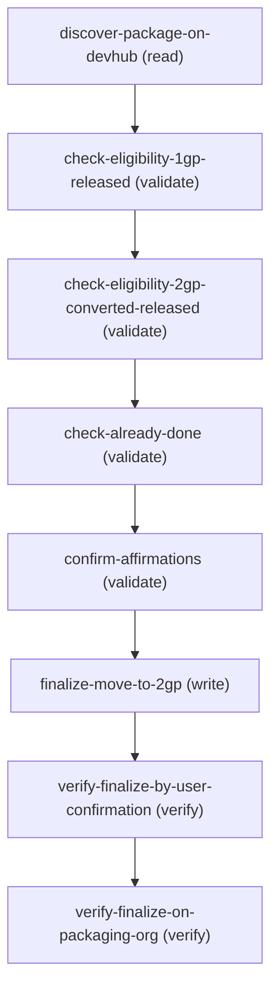

# Move to 2GP Operations Reference

Operations grouped by purpose. Use these as the building blocks for the workflows above.

### Summary

| Operation | Purpose | Status | Call | Depends on |
|-----------|---------|--------|------|------------|
| `discover-package-on-devhub` | read | implemented | `queryPackage2ByConvertedFrom` | — |
| `check-eligibility-1gp-released` | validate | implemented | `queryHighestReleased1GPVersion` | `discover-package-on-devhub` |
| `check-eligibility-2gp-converted-released` | validate | implemented | `queryReleased2GPConvertedVersion` | `check-eligibility-1gp-released` |
| `check-already-done` | validate | implemented | `queryNativePackage2Version` | `check-eligibility-2gp-converted-released` |
| `confirm-affirmations` | validate | implemented | — | `check-already-done` |
| `finalize-move-to-2gp` | write | implemented | `finalizeMoveTo2gp` | `confirm-affirmations` |
| `verify-finalize-by-user-confirmation` | verify | implemented | — | `finalize-move-to-2gp` |
| `verify-finalize-on-packaging-org` | verify | implemented | `queryPackageConversion` | `verify-finalize-by-user-confirmation` |

### Dependency graph

### Read operations

#### `discover-package-on-devhub`

Look up the 2GP Package2 record on DevHub for the 1GP package the user wants to move. The user provides the 1GP package by name (the customer-facing label) or by SubscriberPackageId (the 033... key prefix). Returns the Package2 Id (0Ho... key prefix) and namespace prefix, plus the SubscriberPackageId for use in eligibility queries. This is the DevHub-side anchor for the DevHub-side eligibility checks; the 1GP-side eligibility check uses the SubscriberPackageId (which equals the MetadataPackage Id on the 1GP DE org) directly.

**Call:** `queryPackage2ByConvertedFrom`   — status: `implemented`

**Inputs:**

- `devhub_alias` *(`String`)* — Source: user_input. The `sf` alias of the user's DevHub org. Captured at skill start (see agent_guidance "AT START").
- `subscriber_package_id` *(`String`)* — The 1GP package's SubscriberPackageId (033... key prefix). User provides this directly, or agent obtains it via a MetadataPackage name lookup on the 1GP DE org (see agent_guidance).

### Write operations

#### `finalize-move-to-2gp`

Irrevocably finalize the Move-to-2GP transition by POSTing to the packaging Connect API endpoint `POST /services/data/v69.0/connect/packaging/package/{packageId}/finalize-move-to-2gp` against the 1GP DE (packaging) org. `{packageId}` is the 1GP MetadataPackage Id (033- prefix). The request body carries the three affirmation flags — acknowledgedIrrevocable, acknowledgedTestingComplete, acknowledgedSourceRetrieved — all required and all must be true (these are exactly what the user confirmed in confirm-affirmations). Server-side the endpoint enforces the CreatePackaging edit-access gate, re-validates the three affirmations, confirms the URL packageId matches the org's in-progress conversion, then finalizes it — after which PackageConversion.EndDate is set. Shipped in 266 (operationId finalizeMoveTo2gp, MCP-enabled). On success returns successfullyFinalized, finalizedAt, packageId, and conversionId. For orgs on a pre-266 release, fall back to the manual browser path (invocation.fallback) which delivers the user to viewAllPackage.apexp to click "Move to 2GP" → Proceed.

**Call:** `finalizeMoveTo2gp`   — status: `implemented`

**Inputs:**

- `packaging_org_alias` *(`String`)* — Source - output of confirm-affirmations (transitively from check-eligibility-1gp-released.packaging_org_alias). The `sf` alias of the user's 1GP DE (packaging) org.
  - **Source:** output of `check-eligibility-1gp-released`
- `subscriber_package_id` *(`String`)* — Source - output of confirm-affirmations (transitively from discover-package-on-devhub.subscriber_package_id). The 1GP MetadataPackage's SubscriberPackageId / 033- prefix.
  - **Source:** output of `discover-package-on-devhub`
- `acknowledged_irrevocable` *(`Boolean`)* — Source - output of confirm-affirmations (acknowledged_irrevocable).
- `acknowledged_testing_complete` *(`Boolean`)* — Source - output of confirm-affirmations (acknowledged_testing_complete).
- `acknowledged_source_retrieved` *(`Boolean`)* — Source - output of confirm-affirmations (acknowledged_source_retrieved).

**Depends on:** `confirm-affirmations`

### Verify operations

#### `verify-finalize-by-user-confirmation`

Human cross-check for the pre-266 manual fallback path ONLY: ask the user what the Setup page showed after they clicked Proceed. This step applies only when finalize-move-to-2gp took its manual browser fallback (org on a pre-266 release). In the normal 266 path the agent dispatches the finalize directly and the user never interacts with a browser, so this step is skipped — the endpoint's own response (successfullyFinalized / finalizedAt / conversionId) plus verify-finalize-on-packaging-org's EndDate wire-verify are the authoritative signals. Retained because the fallback still needs a verification surface when no direct-dispatch response exists.

**Status:** `implemented`

**Inputs:**

- `package_name` *(`String`)* — Source - output of finalize-move-to-2gp (transitively from discover-package-on-devhub.package_name).
  - **Source:** output of `discover-package-on-devhub`

**Depends on:** `finalize-move-to-2gp`

#### `verify-finalize-on-packaging-org`

The canonical wire-verification: re-query the PackageConversion record on the 1GP DE org to confirm EndDate is populated (non-null). EndDate is set by the package-conversion finalization service as part of finalize and is the reliable post-finalize wire signal. Uses the read-only PackageConversion Tooling exposure shipped in 264 (1GP DE org auth is already a hard precondition for this skill, so no auth-state branching needed). This is the canonical wire-verify and supplements (rather than replaces) the optional user attestation in verify-finalize-by-user-confirmation. Note: the finalize step's own 266 response also returns finalizedAt + conversionId directly, so this step is a durable cross-check rather than the sole success signal.

**Call:** `queryPackageConversion`   — status: `implemented`

**Inputs:**

- `packaging_org_alias` *(`String`)* — Source - output of verify-finalize-by-user-confirmation (transitively from check-eligibility-1gp-released.packaging_org_alias).
  - **Source:** output of `check-eligibility-1gp-released`
- `subscriber_package_id` *(`String`)* — Source - output of verify-finalize-by-user-confirmation (transitively from discover-package-on-devhub.subscriber_package_id).
  - **Source:** output of `discover-package-on-devhub`

**Depends on:** `verify-finalize-by-user-confirmation`

**Notes:** 264 shipped the read-only public Tooling exposure of PackageConversion (available when packaging is enabled for the org). The fields queried here — Id, EndDate, FinalizedVersionId (FK → SubscriberPackageVersion), FinalizedVersionNumber, and the WHERE key ConvertedFromPackageId (FK → SubscriberPackage) — are all exposed read-only. EndDate non-null means finalize completed. Move-to-2GP does NOT auto-create native Package2Version records on DevHub (native creation is a separate user-driven step), so there is no Package2Version-based wire-verify; EndDate is the reliable signal.

### Other operations

#### `check-eligibility-1gp-released`

Find the highest Released 1GP major.minor version of the package by querying MetadataPackageVersion on the 1GP DE org. MetadataPackageVersion is the 1GP DE-side view of `all_package_version` joined with `dev_package_version`, with a `ReleaseState` STATICENUM field whose Released picklist value is `"Released"`.

**Call:** `queryHighestReleased1GPVersion`   — status: `implemented`

**Inputs:**

- `packaging_org_alias` *(`String`)* — Source: user_input. The `sf` alias of the user's 1GP DE (packaging) org. Captured at skill start (see agent_guidance "AT START").
- `subscriber_package_id` *(`String`)* — Source - output of discover-package-on-devhub. Note: the SubscriberPackageId (033... key prefix) on DevHub is the same Id as MetadataPackage on the 1GP DE org — both wrap the same all_package row.

**Depends on:** `discover-package-on-devhub`

#### `check-eligibility-2gp-converted-released`

Confirm a 2GP-converted Package2Version exists at the same major.minor as the highest Released 1GP version, AND that the 2GP version is Released. This is the second half of the eligibility gate — Move-to-2GP requires the highest 1GP major.minor to have a corresponding RELEASED 2GP-converted equivalent. Queries Package2Version on DevHub.

**Call:** `queryReleased2GPConvertedVersion`   — status: `implemented`

**Inputs:**

- `devhub_alias` *(`String`)* — Source - output of check-eligibility-1gp-released (transitively from discover-package-on-devhub.devhub_alias).
  - **Source:** output of `discover-package-on-devhub`
- `package2_id` *(`String`)* — Source - output of check-eligibility-1gp-released (transitively from discover-package-on-devhub.package2_id).
  - **Source:** output of `discover-package-on-devhub`
- `major` *(`Integer`)* — Source - output of check-eligibility-1gp-released (highest_1gp_major).
- `minor` *(`Integer`)* — Source - output of check-eligibility-1gp-released (highest_1gp_minor).

**Depends on:** `check-eligibility-1gp-released`

#### `check-already-done`

Detect the early-exit case — if a native (non-converted) Package2Version exists for this Package2, Move-to-2GP has ALREADY happened OR the package was 2GP-native to start with. Native 2GP versions are characterized by ConvertedFromVersionId = NULL. If any such Package2Version exists, the skill exits immediately.

**Call:** `queryNativePackage2Version`   — status: `implemented`

**Inputs:**

- `devhub_alias` *(`String`)* — Source - output of check-eligibility-2gp-converted-released (transitively from discover-package-on-devhub.devhub_alias).
  - **Source:** output of `discover-package-on-devhub`
- `package2_id` *(`String`)* — Source - output of check-eligibility-2gp-converted-released (transitively from discover-package-on-devhub.package2_id).
  - **Source:** output of `discover-package-on-devhub`

**Depends on:** `check-eligibility-2gp-converted-released`

#### `confirm-affirmations`

Present the irrevocability + testing affirmations to the user, mirroring the "Move to Second-Generation Managed Packaging" dialog shown in Setup UI. The user must explicitly confirm each affirmation before the agent proceeds to the (manual) finalize step. This step has no API surface — it's a structured agent-to-user interaction encoded in the SOR for contract consistency between the eventual 266 Connect API (which is expected to require these as request-body fields) and the pre-266 manual flow.

**Status:** `implemented`

**Inputs:**

- `package_name` *(`String`)* — Source - output of check-already-done (transitively from discover-package-on-devhub.package_name).
  - **Source:** output of `discover-package-on-devhub`
- `package2_id` *(`String`)* — Source - output of check-already-done (transitively from discover-package-on-devhub.package2_id).
  - **Source:** output of `discover-package-on-devhub`

**Depends on:** `check-already-done`
